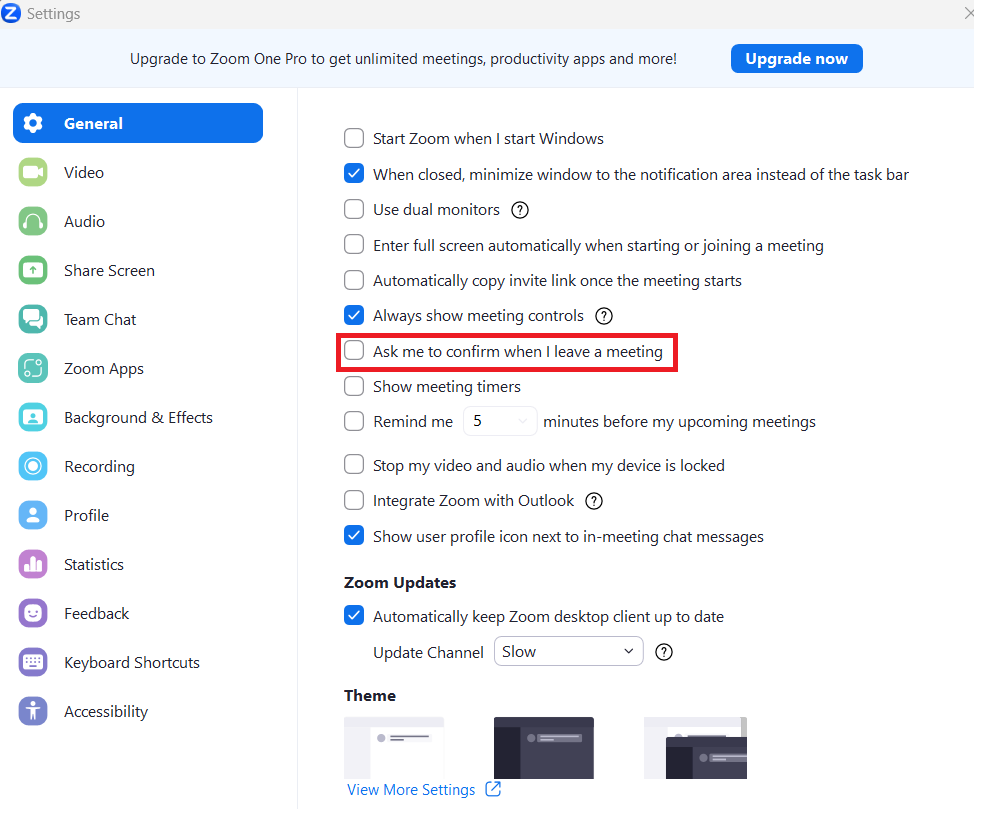
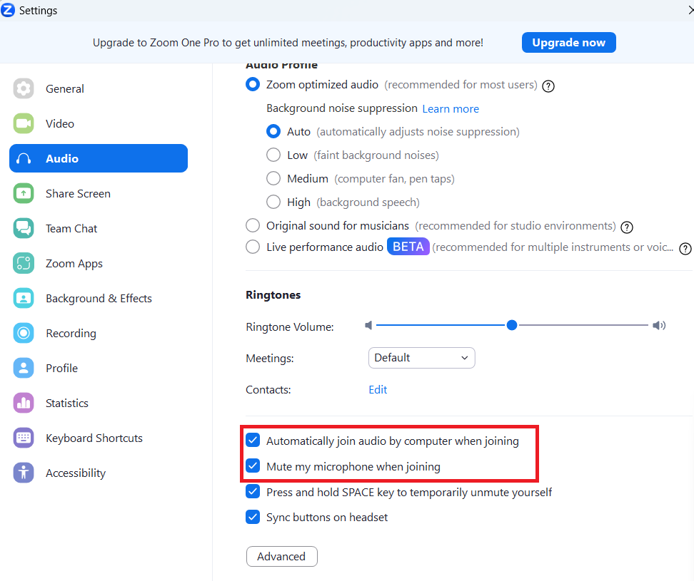
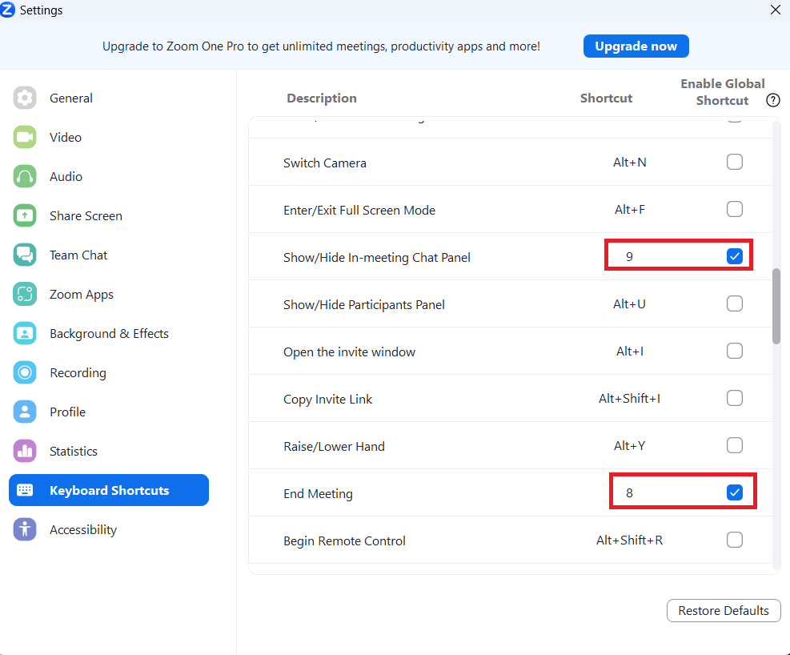

# Introduction
This service allows you to join scheduled zoom meetings, interact with chat via telegram bot linked to.

# Requirements
1. PyCharm or any other IDE supporting Python 3.7
2. Python 3.7
3. Zoom

# Getting started
### Zoom setup
1. Go to Zoom Settings, choose general and uncheck "Ask me to confirm when I leave" box as it is shown below.



2. After that, click on Audio settings and make sure the following boxes are checked.



3. Finally, setup hotkeys in the Keyboard Shortcuts settings.
 - setup "Show/Hide In-meeting Chat Panel" to "9" and make sure to check the related box.
 - setup "End Meeting" to "8" and make sure to check the related box.



### Project Setup

1. Run the following in Terminal.
```bash
pip install -r requirements.txt
```
2. Setup the schedule for meetings, telegram user IDs who have permission o run commands and the telegram bot token in data.py
Also fill in your name, surname and group as well.
```bash
schedule = [
    ["https://us04web.zoom.us/j/75035608519?pwd=BrnrasoTj4kzHMivVF7i7kUXen0kOG.1", "8:40", "10:35"],
    ["link2", "start time", "end time"],
    ["link3", "start time", "end time"]
]
user_ids = [
    "userId1",
    "userId2",
    "userId2"
]

TOKEN = 'MyToken'
NAME = "Андрій"
SURNAME = "Назаренко"
GROUP= "ДО-4"
```

### Commands
1. ```/fullname``` command writes the full name and group to the zoom chat.
2. ```/surname``` command writes the surname and group to the zoom chat.
3. ```/chat {Your message}``` command writes the following text to the zoom chat.
4. ```/drop``` command makes the user leave the meeting.
5. ```/join {Meeting link}``` command makes the user join the meeting.

### Support
Telegram: @oondrash
